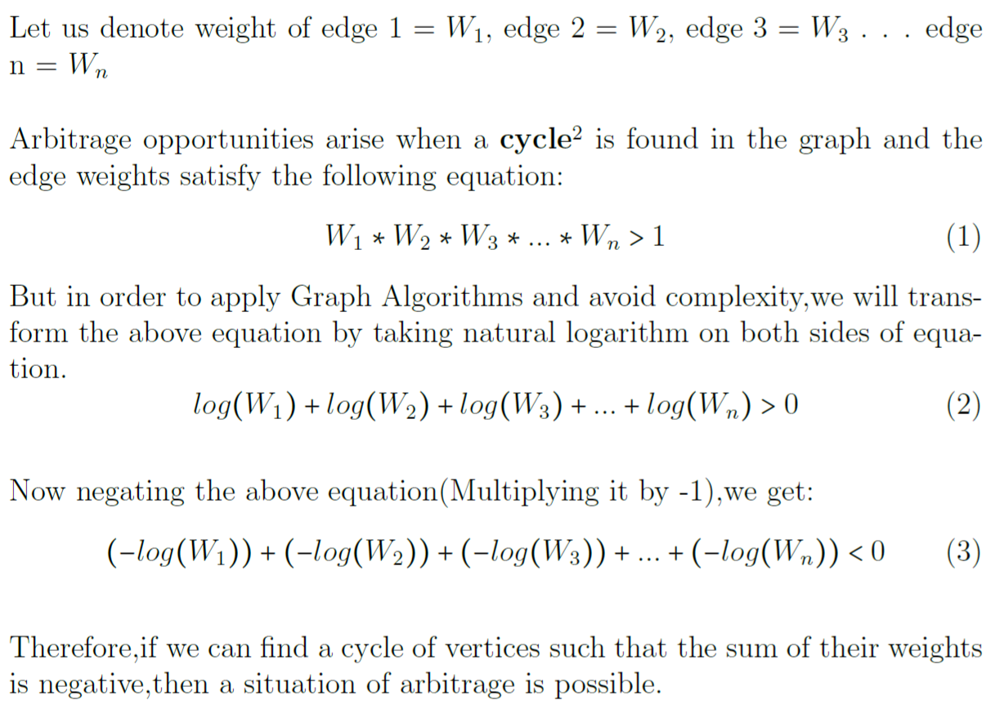

# Arbitrage Opportunity Finder - Swiss Borg coding challenge 
A console based application that uses the Bellman-Ford algorithm to detect arbitrage opportunities.

## How to run
This application is written using scala 3 and scala-cli. 
* To run the application download [scala-cli](https://scala-cli.virtuslab.org/install)
* Run `scala-cli run .` in root directory

## Explanation

The Bellman-Ford algorithm finds the minimum path from a single source vertex to all other vertices on a weighted
directed graph. These negative-weight cycles represent arbitrage opportunities in the market and in theory allow us to make risk-free profit.

The application assigns currencies to different vertices with the edge weight representing the exchange rate. Since the 
algorithm finds the minimum distance the exchange rate will be transformed by taking its natural logarithm and multiplying it by -1. 
By doing so, if we can find a cycle of vertices such that the sum of their weights is negative then a situation of arbitrage is possible.

See image below


## Application time complexity
* Bellman Ford algorithm: O(V.E) or O(V^3) if graph is a complete graph
* Application: O(V.V.E) or O(V^4) if graph is a complete graph
* NB: V = total vertices and E = total edges in the graph

## Note about CHSB (BORG)
Most arbitrage opportunities involves CHSB currency. This implies converting other currencies such as DAI to CHSB and selling CHSB tends to be profitable. 
I think this makes CHSB a convertible and stable currency asset.

## Output
Below is a sample output. </br>

```
ARBITRAGE OPPORTUNITIES DETECTED
====================================================
Path: [BTC,DAI,EUR,CHSB,BTC] -> 0.024166299238782774
Path: [EUR,CHSB,BTC,DAI,EUR] -> 0.024166299238782996
```

## Dependencies
1. [Scala 3](https://www.scala-lang.org/)
2. [Circe](https://circe.github.io/circe/) - For parsing JSON data
3. [Sttp](https://sttp.softwaremill.com/en/stable/index.html) - For making HTTP calls
4. [ScalaTest](https://www.scalatest.org/) - Tests
5. [scala-cli](https://scala-cli.virtuslab.org/install)

## Tests
* Test have been added to the application to verify it correctness.
* Tests were implemented using [ScalaTest](https://www.scalatest.org/)
* To run tests run `scala-cli test .`
